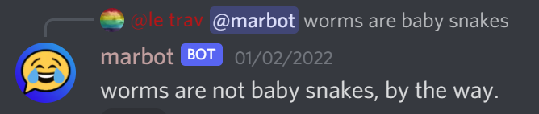

# MarkBot for Discord

A Markov chain bot using markov-strings.

## Usage

1. Configure what channels you want the bot to listen/learn from:
    * User: `/listen modify`
    * Bot: 
1. Train the bot in a lengthy text channel:
    * User: `/train`
    * Bot: 
1. Ask the bot to say something:
    * User: `/mark`
    * Bot: 

### Training from files

You can train the bot using JSON files in several ways:

1. Using the `json` option in the `/train` command to import a single file of messages.
2. Using the command line to train from either a single file or an entire directory of JSON files.
3. Using discord-parser.py to convert DiscordChatExporter files for bulk training.

#### Using DiscordChatExporter with discord-parser.py

If you have JSON files exported from [DiscordChatExporter](https://github.com/Tyrrrz/DiscordChatExporter), you can use the included discord-parser.py script to convert them into the format required for training:

1. Export your Discord channel history using DiscordChatExporter in JSON format
2. Run the parser (located in ./imports directory) on your exported files:
   ```bash
   python3 ./imports/discord-parser.py -i input_file.json -o output_file.json
   ```
   Or process an entire directory of exported files:
   ```bash
   python3 ./imports/discord-parser.py -i input_directory/ -o output_directory/
   ```
3. Use the converted files with train.js for bulk training (see "Using the Command Line" below)

The parser will convert DiscordChatExporter's format into the simple message format required by the bot, making it easy to import large channel histories.

#### Using the Discord Command
Use the `json` option in the `/train` command to import a single file of messages.
An example JSON file can be seen [here](img/example-training.json).

#### Using the Command Line
For bulk training from multiple files, you can use the command line interface. First, build the training script:

```bash
# Build the TypeScript files
npm run build
```

Then you can use the training script:

```bash
# Train from a single JSON file
node build/train.js <guildId> <jsonPath> [--keep-existing]

# Train from all JSON files in a directory
node build/train.js <guildId> <directoryPath> --directory [--keep-existing] [--expose-gc]
```

Options:
- `--keep-existing`: Don't clear existing training data before importing
- `--directory`: Process all JSON files in the specified directory
- `--expose-gc`: Enable garbage collection for better memory management (recommended for large directories)

Each JSON file should contain an array of messages in this format:
```json
[
  {
    "message": "Message content",
    "attachments": ["optional", "attachment", "urls"]
  }
]
```

When training from a directory:
- All .json files in the directory will be processed
- Files are processed sequentially to manage memory usage
- Progress is shown for each file
- A total count of processed messages is provided at the end

Security and Performance Notes:
- The directory must be within the project's working directory for security
- The process will create lock files in the config directory to prevent concurrent training
- Memory usage is monitored and managed automatically
- For large directories, use the `--expose-gc` flag for better memory management:
  ```bash
  node --expose-gc build/train.js <guildId> <directoryPath> --directory
  ```
- Training can be safely interrupted with Ctrl+C; state will be preserved
- Use `--keep-existing` to resume interrupted training

## Setup

This bot stores your Discord server's entire message history, so a public instance to invite to your server is not available due to obvious data privacy concerns. Instead, you can host it yourself.

1. Create a [Discord bot application](https://discordapp.com/developers/applications/)
1. Under the "Bot" section, enable the "Message Content Intent", and copy the token for later.
1. Setup and configure the bot using one of the below methods:

### Docker

Running this bot in Docker is the easiest way to ensure it runs as expected and can easily recieve updates.

1. [Install Docker for your OS](https://docs.docker.com/get-docker/)
1. Open a command prompt and run:

    ```sh
    docker run --restart unless-stopped -d -v /my/host/dir:/usr/app/config ghcr.io/claabs/markov-discord:latest
    ```

    Where `/my/host/dir` is a accessible path on your system. `--restart=unless-stopped` is recommended in case an unexpected error crashes the bot.
1. The Docker container will create a default config file in your mounted volume (`/my/host/dir`). Open it and add your bot token. You may change any other values to your liking as well. Details for each configuration item can be found here: <https://claabs.github.io/markov-discord/classes/AppConfig.html>
1. Run the container again and use the invite link printed to the logs.

### Windows

1. Install [Node.js 16 or newer](https://nodejs.org/en/download/).
1. Download this repository using git in a command prompt

    ```cmd
    git clone https://github.com/claabs/markov-discord.git
    ```

    or by just downloading and extracting the [project zip](https://github.com/claabs/markov-discord/archive/master.zip) from GitHub.
1. Open a command prompt in the `markov-discord` folder.

    ```sh
    # NPM install non-development packages
    npm ci
    # Build the Typescript
    npm run build
    # Initialize the config
    npm start
    ```

1. The program will create a `config/config.json` in the project folder. Open it and add your bot token. You may change any other values to your liking as well. Details for each configuration item can be found here: <https://claabs.github.io/markov-discord/classes/AppConfig.html>
1. Run the bot:

    ```sh
    npm start
    ```

    And use the invite link printed to the logs.
